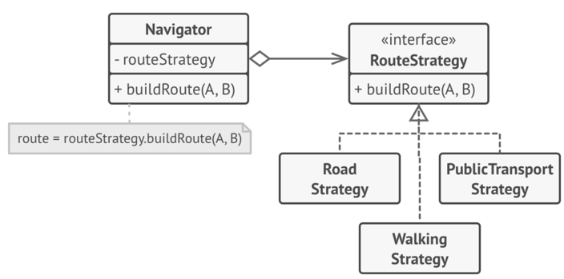
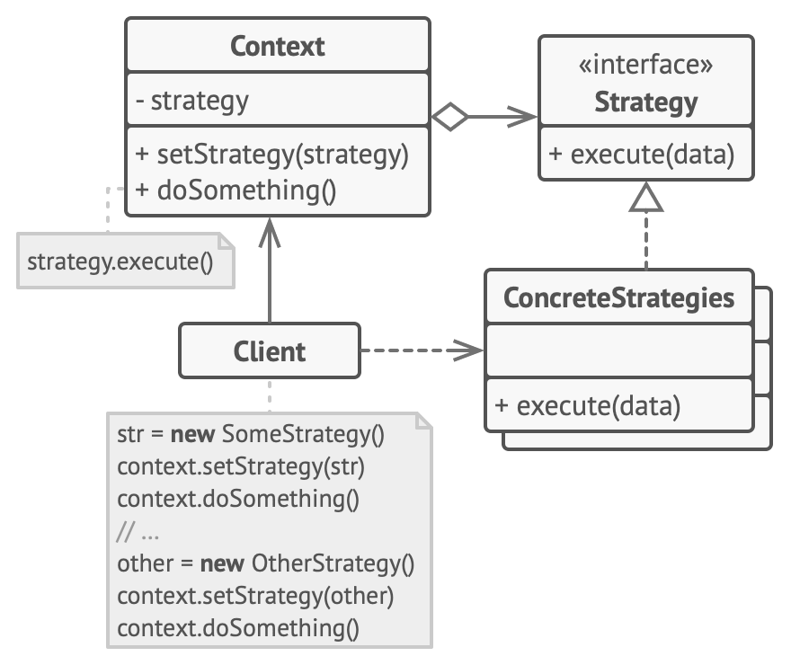

## 여행자들을 위한 네비게이션 앱  
### 기능 및 방향성
1. 처음에는 차로 다니는 도로를 위한 방향을 제시하는 기능
2. 다음 업데이트에는 걸어다니는 도로를 위한 방향을 제시하는 기능 추가
3. 또 다음에는 대중 교통을 위한 방향을 제시하는 기능 추가

이런식으로 자꾸 기능 추가
### 문제 발생
1. 새로운 기능(알고리즘)이 추가될 때마다 네비게이션의 main class 가 자꾸 비대해짐
2. 간단한 버그 수정같은 알고리즘을 변경할 때마다 전체 클래스에 영향을 끼치므로 이미 작동하는 코드에서 오류가 발생.

그니까 매우 큰 클래스 하나 때문에 팀들간 소스충돌도 발생하고 난리도 아님

### 해결방법
1. 추가된 기능(알고리즘)을 하는 클래스를 전략이라고 부르고 분리한다.
2. context라 불리는 original class는 빈드시 각 전략(알고리즘)을 참조하는 field를 저장해야 한다.
3. 이 context는 각 전략을 직접 하는 대신, 각 전략(field)이 참조하는 class에 그 일을 위임한다.
4. context는 작업에 적합한 알고리즘을 선택하는 책임이 없습니다. 대신 client가 context에 원하는 전략을 넘겨줍니다.
5. 실제로 context는 전략이 뭘 하는지 모릅니다.
6. It works with all strategies through the same generic interface, which only exposes a single method for triggering the algorithm encapsulated within the selected strategy.

* context는 전략 구현체와 독립적입니다. 그래서 새로운 알고리즘을 추가하거나, 기존 코드를 변경할 때, 다른 전략코드 수정이나, context변경 없이 가능하게 됩니다.

1. 각 라우트 알고리즘은 단일 buildRoute메서드를 이용하여 단일 클래스로 추출할 수 있습니다.
2. The method accepts an origin and destination and returns a collection of the route’s checkpoints.
3. Even though given the same arguments, each routing class might build a different route, the main navigator class doesn’t really care which algorithm is selected since its primary job is to render a set of checkpoints on the map.
4. The class has a method for switching the active routing strategy, so its clients, such as the buttons in the user interface, can replace the currently selected routing behavior with another one.
---
## Real-World Analogy
공항에 가야하는 상황입니다.
1. 버스를 타거나
2. 택시를 타거나
3. 자전거를 탈 수 있습니다.

이것들은 이동수단 전략들 입니다. 당신은 1.예산, 2.시간 같은 요인에 의존해서 전략중 하나를 선택할 수 있습니다.

1. Context는 전략구현체중 하나를 참조하는 필드를 유지하고, 오직 전략 interface와만 통신하여 이 객체와 통신할 수 있습니다.
2. 전략 interface는 모든 전략 구현체의 공통 인터페이스입니다. context가 전략 구현체를 사용하기 위한 메서드를 선언합니다.
3. 전략 구현체들은 각 전략에 대한 알고리즘을 구현합니다.
4. context는 전략 객체에 